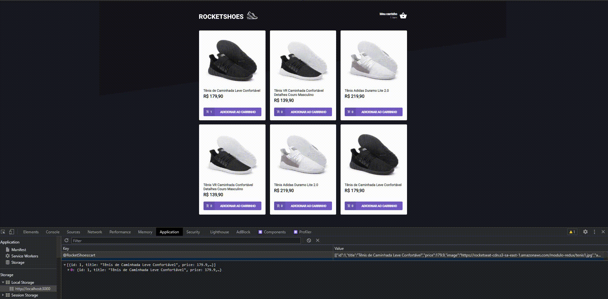

<h1> RocketShoes </h1>

> Status: Developer ☝️

### Objetivo 
#### Nesse módulo do Ignite, foi proposto um desafio afim de revisar os estudos, [**useState**](https://pt-br.reactjs.org/docs/hooks-state.html), [**useEffect**](https://pt-br.reactjs.org/docs/hooks-effect.html) e [**ContextAPI**](https://pt-br.reactjs.org/docs/context.html)  

 
  

### Sobre
<small> A RocketShoes, é uma pequena parte de um e-commerce. Onde o usuário poderá verificar os tenis que o mesmo quer comprar. Cada tênis tem um valor, e você poderá adicionar dentro do carrinho de compras. Ao adicionar os produtos dentro do carrinho de compras, ele poderá adicionar mais quantidades ou até diminuir. Caso o estoque esteja baixo, será emitido uma alerta, avisando que você não pode comprar acima daquela quantidade.

</small>

### Técnicas

- [x] Componentes
- [x] Hooks
- [X] Consumo de Api (Fake API com JSON Server) 
- [X] Preservando carrinho com localStorage API
- [X] Mostrando erros com Toastify
- [X] ContextAPI
- [X] Styled-components

## Rodar o Projeto

#### `yarn start`
Ao abrir o projeto dentro do seu editor de código

#### `yarn server`
Ao abrir o projeto dentro do seu editor de códig, para executar servidor

 
  <small> Josileudo Rodrigues - 2021</small>
</div
